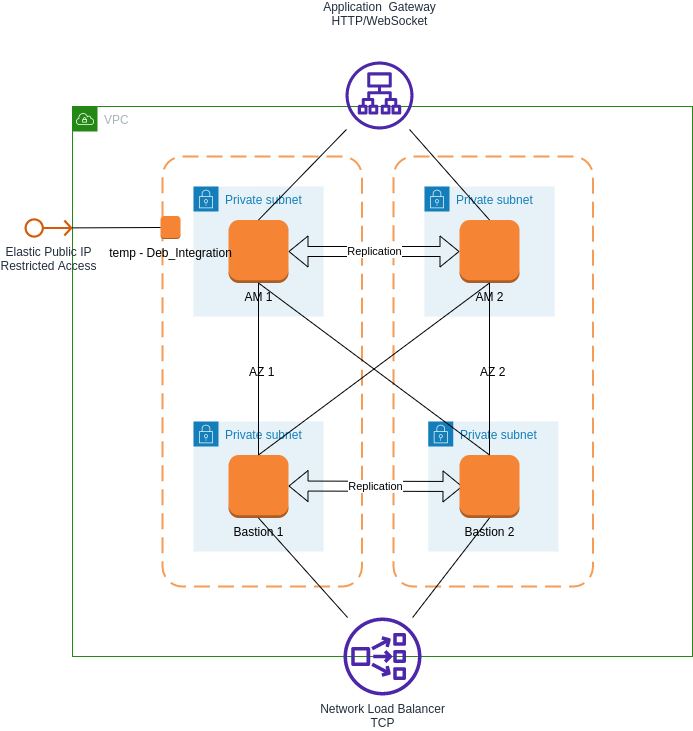

# Deploy WALLIX access manager and Bastion cluster with loadbalancer on AWS

This is an exemple of AWS deployment with cluster setup.



## Requirements

* Access and Right to AWS
* AMI were shared by WALLIX Support
* terraform is installed

Adapt samples to your needs

```bash
cp lab.auto.tfvars.example lab.auto.tfvars
vi lab.auto.tfvars
```

## Deploy

```bash
terraform init      # initializes the working directory 
terraform fmt       # format files
terraform validate  # validates the configuration files 

terraform apply     # apply configuration
```

## Configure

Connect to the integration host by ssh.

There is restriction set for appliance configuration and global organisation on both AM throught LoadBalancer rules and not HTTPS access to Session Manager from outside the VPC.
Use x11 forwarding and run firefox on the Debian Host to access it.

```bash
ssh -i private_key.pem -X admin@<ip_debian_host>
admin# firefox
```

Connect and configure Access and Session Manager on port 2242 :

* Set Password
* Set Hostname
* Set http_host_trusted_hostnames (/var/wab/etc/wabengine.conf)
* Setup Replication

## Known issues

### Debian Terms and Conditions not accepted

You must accept [terms and condition of Debian 11](https://aws.amazon.com/marketplace/pp/prodview-l5gv52ndg5q6i) before use of this template.

### Failing to import certificate on loadbalancer

For some reason there is sometimes a 403 error while importing certificate on LB listener, it's linked to the rights to access certificate's vault.
You need to manually create the listener and import it before refreshing and re-apply configuration.

```bash
terraform import aws_lb_listener.Frontend_AM arn:aws:elasticloadbalancing:eu-west-3:519101999238:listener/app/Access-Manager-Front/059ce0c7d3b69254/9c0b0d80abe0ef50
```

### Error 502 on LB URL

You should configurate first both Access Manager.
Don't forget to add the http_host_trusted_hostnames as [described on the KB](https://support.wallix.com/s/article/URL-Redirection-Issue)

### Network load balancer not functionnal

Yes, as it is not finish yet.
